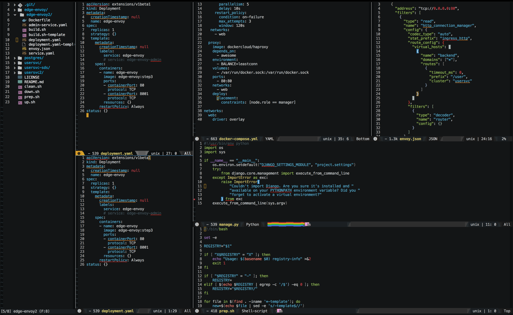
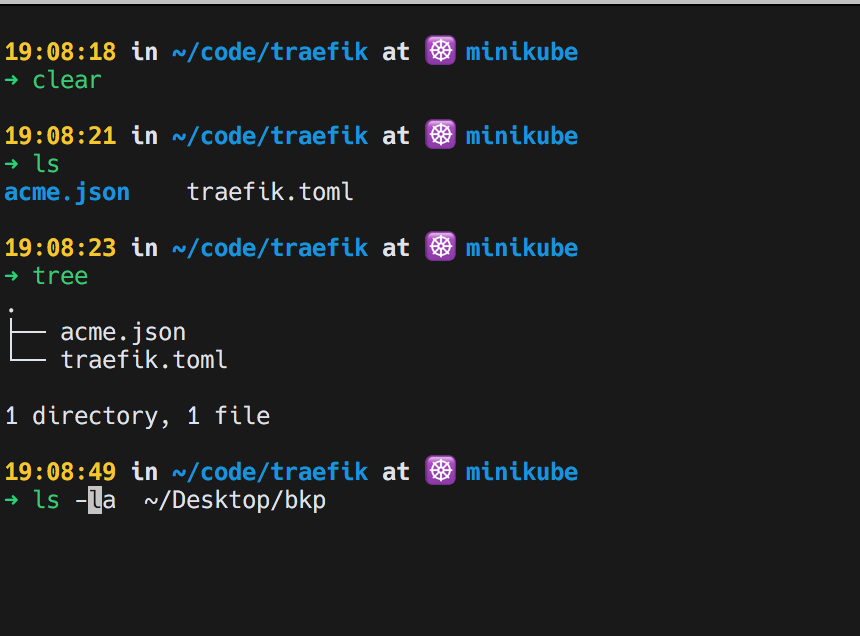
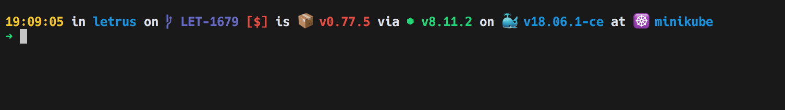

### My personal dotfiles for use on Mac and Arch linux(awesome, and i3gaps)

*There's 2 branches, one for Mac OS other for Arch Linux*
 - master: Mac OS
 - arch-awesome: Arch + AW
 - future arch-i3: For Arch + i3

Configs for:

 - Emacs
 - Zsh
 - Tmux
 - Vim
 - Brew

Some screenshots:

**Emacs**

**Zsh**

**Zsh**

**TODO**

 - List of all software
 - Add more descriptions
 - Create a script to install

<!--  LocalWords:  Configs
 -->
